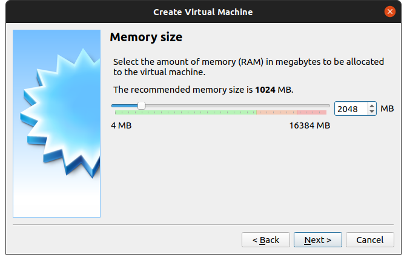
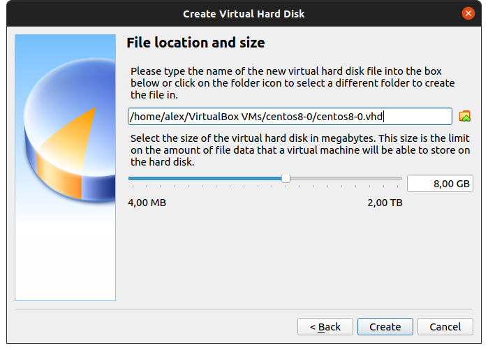
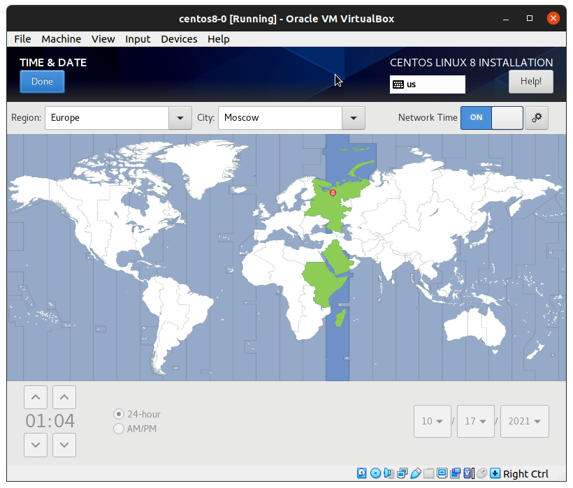
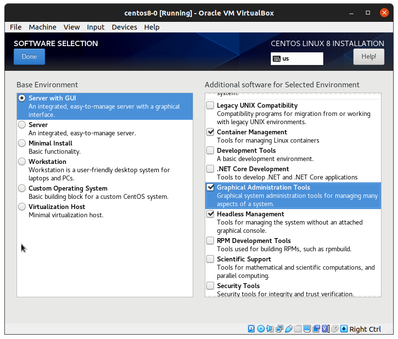
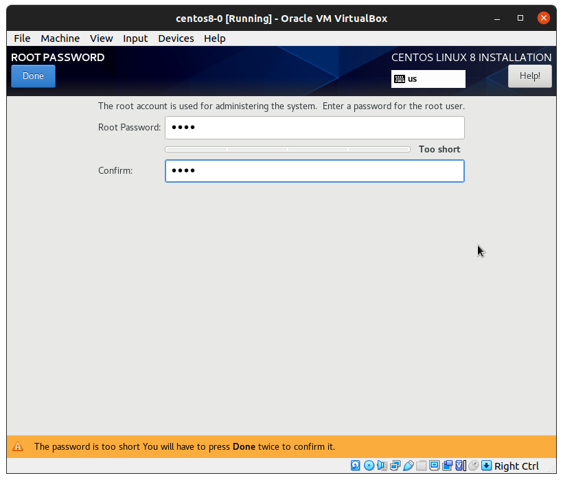
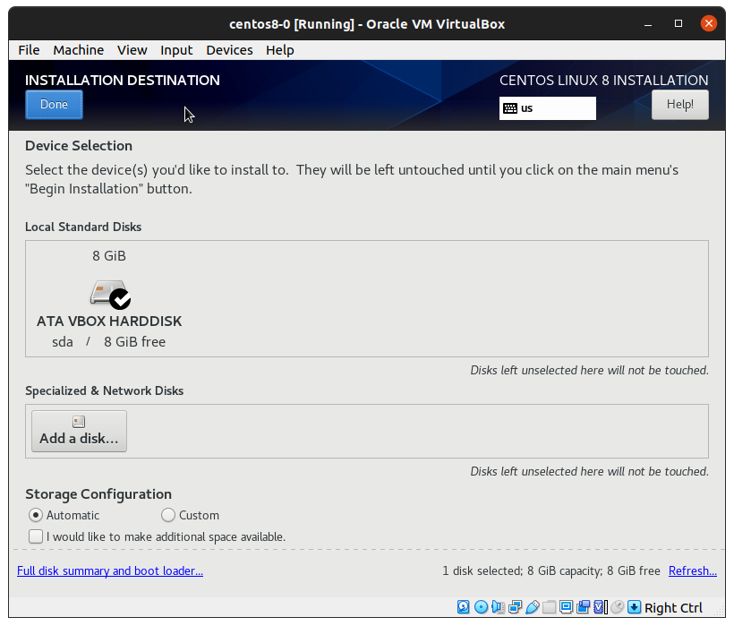

# Установка виртуальной машины

Рабочая станция:
- `CPU`: Intel core i7 11370H
- `RAM`: 16GB 
- `OS`: Ubuntu 20.10
- `Kernel`: 5.13.0-19-generic

## Подготовка окружения

Инструменты:
- VirtualBox
- CentOS 8

### Установка CentOS

Указываем 2 гигабайта оперативной памяти - минимальное значение для версии с GUI.

Выделяем виртуальный диск для CentOS.
- Можно вырать Динамическую аллокацию памяти - тогда на хостовой машине будет занято ровно столько места, сколько весит виртуалка
- Есть показания к лучшей производительности фиксированного размера

Я предпочту динамическую аллокацию из-за малого количества места на диске

8 гигабайт ПЗУ должно хватить под пет проекты и для учебных целей

В настройках виртуальной машины для удобства выставляем общий буфер обмена двунаправленный 

В настройках сети ставим Bridged Adapter

Выбираем первый пункт - установить CentOS и загружаем графический установщик

В настройках сети включаем интернет и снизу слева выбираем имя компьютеру

В настройках Date & Time включаем Network Time и выставляем часовой пояс

Настраиваем пакеты в `Software Selection`. Для удобства выберем Server with GUI и протыкаем нужные пакеты:
- System Tools
- Headless Management
- Container Management 
- Performance Tools
- Debugging Tools
- Graphical Administration Tools

Далее необходимо задать пароль суперпользователя:

Нажимаем разметку дисков и продолжаем установку

